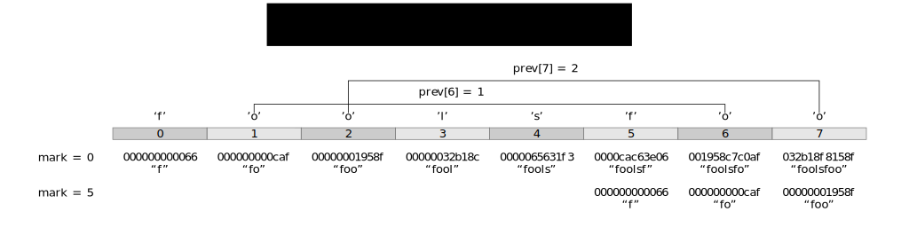

# match

_Rabin–Karp algorithm in C++ to find recurring substrings
in a string and use them to construct an edit list._

## Overview

This is a single header C++ implementation of the Rabin–Karp algorithm to find
recurring substrings in a string. This code finds self-matching substrings
using a rolling hash known as a Rabin–Karp signature, which is a hash sum
product, composed and recorded in a hashtable incrementally using multiple
string length combinations offset from an increasing mark. These signatures
are then looked up in the hashtable at each step to find matching substrings.



The algorithm records offsets of substring occurances in a hash table
(_'head'_) indexed by the Rabin–Karp signature and uses the hash table
information to compose a chain of occurances in a second table (_'prev'_),
indexed by offset, which leads from the current match to the last match.
Each position in the previous match table contains an offset to the last
match for the same signature recorded at a prior offset.

The search algorithm, after updating the hash table and previous match table,
checks for a hit, and if there is a hit, it follows the chains of past offsets
leading through all prior occurances of a particular Rabin–Karp signature,
all the way back to the earliest match. The algorithm then verifies these
approximate matches, and if valid, creates copy instructions for the best
match, or, alternatively emits literal instructions for new text. The matches
are approximate because there is a collision probability, however, there are
multiple offsets that can be used to match a prior occurance, which aids with
the probabalistic nature of the algorithm.

The output is a list of instructions referencing new data
or copies of previous data.

- ___Vector&lt;Match&gt;___
  - ___Type___ type (* _Literal_ or _Copy_ *)
  - ___Size___ offset
  - ___Size___ length

## Example

The following is an example invocation of the included test program:

___Test command___:
```
$ ./build/match -v -t TGGGCGTGCGCTTGAAAAGAGCCTAAGAAGAGGGGGCGTCTGGAAGGAACCGCAACGCCAAGGGAGGGTG
```

___Expected output___:
```
OriginalText: TGGGCGTGCGCTTGAAAAGAGCCTAAGAAGAGGGGGCGTCTGGAAGGAACCGCAACGCCAAGGGAGGGTG
[  0] : Literal [   0,  7 )   # "TGGGCGT"
[  1] :    Copy [   4,  3 )   # "GCG"
[  2] : Literal [   0, 14 )   # "CTTGAAAAGAGCCT"
[  3] :    Copy [   8,  4 )   # "AAGA"
[  4] :    Copy [  11,  4 )   # "AGAG"
[  5] :    Copy [  31,  3 )   # "GGG"
[  6] :    Copy [  32,  4 )   # "GCGT"
[  7] : Literal [   0,  1 )   # "C"
[  8] :    Copy [  40,  3 )   # "TGG"
[  9] :    Copy [  27,  3 )   # "AAG"
[ 10] :    Copy [  33,  3 )   # "GAA"
[ 11] : Literal [   0,  6 )   # "CCGCAA"
[ 12] :    Copy [   5,  3 )   # "CGC"
[ 13] :    Copy [   6,  3 )   # "CAA"
[ 14] :    Copy [  60,  3 )   # "GGG"
[ 15] : Literal [   0,  1 )   # "A"
[ 16] :    Copy [  64,  3 )   # "GGG"
[ 17] : Literal [   0,  2 )   # "TG"
DataSize/Literals/Copies: 70/31/39
OuterIterations/InnerIterations: 1018/750
```
